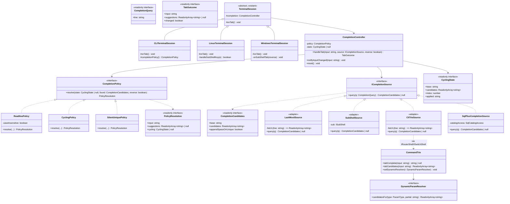

# DESIGN — Socle unifié d'auto-complétion des terminaux d'équipements

**Version** : 1.0
**Date** : 2026-07-08
**PRD parent** : `docs/PRD-Auto-Completion.md`
**Statut** : IMPLÉMENTÉ — les étapes M1 à M9 (§5) sont livrées, testées et poussées sur `mandeng`.

---

## 1. Objectif et principes directeurs

Le PRD identifie que la complétion existe aujourd'hui sous **quatre
implémentations indépendantes et divergentes** :

| Source actuelle | Algorithme | État de cycling | Application au buffer |
|---|---|---|---|
| `CLITerminalSession.onTab` (Cisco/Huawei) | `CommandTrie.tabComplete` → chaîne complète ou `null` | aucun | remplace tout l'input |
| `LinuxTerminalSession.onTab` (bash top-niveau) | `completeInput` (préfixe commun) | aucun | dernier mot |
| `WindowsTerminalSession.onTab` (cmd) | `completeInputCaseInsensitive` | aucun | dernier mot |
| `WindowsTerminalSession.onSubShellTab` (PowerShell) | ad-hoc (`this.completion`) | ad-hoc dans la session | dernier mot |

Et une **cinquième absente** : `LinuxTerminalSession.handleSubShellKey` n'a
aucun branchement `Tab` (bug majeur du PRD, §1.3 item 1).

Principes du socle cible :

1. **Une seule machine à états côté session** (`CompletionController`) —
   le cycling, la réinitialisation sur frappe, l'application au buffer et
   la production des suggestions à afficher ne sont plus jamais réécrits
   par session ni par équipement.
2. **Un seul contrat côté source de candidats** (`ICompletionSource`) —
   chaque équipement/shell ne fournit que ses candidats et la partie
   intouchée de la ligne ; il n'implémente jamais de logique de touche.
3. **La différence vendor est une politique, pas une implémentation**
   (`CompletionPolicy`) : readline (bash/cmd), cycling (PowerShell,
   Huawei), silencieux-si-ambigu (Cisco). Ajouter un nouvel équipement =
   fournir une source + choisir une politique existante.
4. **Migration destructrice assumée** : `TabCompletionHelper.ts` et le
   state ad-hoc `WindowsTerminalSession.completion` disparaissent à la fin
   de la migration — pas de double chemin conservé.
5. **TypeScript strict maximal pour tout le nouveau code** : le répertoire
   `src/terminal/completion/` est vérifié par un tsconfig dédié
   (`tsconfig.completion.json`) avec `strict`, `noUncheckedIndexedAccess`,
   `exactOptionalPropertyTypes`, `noImplicitOverride`,
   `noFallthroughCasesInSwitch`, `noImplicitReturns` — indépendamment du
   `strict: false` global (dont la migration reste un chantier séparé).

---

## 2. Diagramme de classes cible



---

## 3. Contrats TypeScript (signatures normatives)

Nouveau répertoire `src/terminal/completion/` :

```ts
// types.ts
export interface CompletionQuery {
  readonly line: string;
}

export interface CompletionCandidates {
  /** Partie gauche de la ligne, conservée telle quelle. */
  readonly base: string;
  /** Remplacements complets de ce qui suit `base` (jamais des suffixes). */
  readonly candidates: readonly string[];
  /** Candidat unique → ajouter une espace finale (« show » → « show  »). */
  readonly appendSpaceOnUnique: boolean;
}

export interface ICompletionSource {
  /** null ⇔ aucune complétion possible pour cette ligne. */
  query(q: CompletionQuery): CompletionCandidates | null;
}

export interface CyclingState {
  readonly base: string;
  readonly candidates: readonly string[];
  readonly index: number;
  /** Dernière valeur écrite dans le buffer — détecte « Tab sans édition ». */
  readonly applied: string;
}

export interface PolicyResolution {
  readonly input: string;
  readonly suggestions: readonly string[] | null;
  readonly cycling: CyclingState | null;
}

export interface CompletionPolicy {
  resolve(
    state: CyclingState | null,
    found: CompletionCandidates,
    reverse: boolean,
  ): PolicyResolution;
}

export interface TabOutcome {
  readonly input: string;
  readonly suggestions: readonly string[] | null;
  readonly changed: boolean;
}
```

```ts
// CompletionController.ts
export class CompletionController {
  constructor(policy: CompletionPolicy);
  /** Tout l'algorithme de Tab : requête source → politique → nouvel input. */
  handleTab(input: string, source: ICompletionSource, reverse: boolean): TabOutcome;
  /** À appeler sur toute frappe non-Tab : invalide le cycle en cours. */
  notifyInputChanged(input: string): void;
  reset(): void;
}
```

```ts
// policies.ts
export class ReadlinePolicy implements CompletionPolicy {
  constructor(options: { readonly caseInsensitive: boolean });
}
export class CyclingPolicy implements CompletionPolicy {}
export class SilentUniquePolicy implements CompletionPolicy {}
```

```ts
// sources.ts — adaptateurs de migration
/** Candidats « dernier mot » (bash, cmd, ISubShell.getCompletions). */
export class LastWordSource implements ICompletionSource {
  constructor(fetch: (line: string) => readonly string[]);
}
/** Candidats « ligne complète » (CommandTrie.tabCandidates). */
export class FullLineSource implements ICompletionSource {
  constructor(fetch: (line: string) => readonly string[]);
}
```

Extensions de contrats existants (migration) :

```ts
// CommandTrie.ts — additif
export interface DynamicParamResolver {
  candidatesFor(type: ParamType, partial: string): readonly string[];
}
export class CommandTrie {
  /** Candidats de complétion (lignes complètes), statiques + dynamiques. */
  tabCandidates(input: string): readonly string[];
  setDynamicResolver(resolver: DynamicParamResolver | null): void;
  /** Conservé : équivalent à « tabCandidates().length === 1 ». */
  tabComplete(input: string): string | null;
}

// IRouterShell.ts / ISwitchShell.ts — nouvel élément requis
tabCandidates(input: string): readonly string[];

// Router.ts / Switch.ts — plomberie device → shell (mêmes variantes ForVty)
cliTabCandidates(input: string): readonly string[];

// ISubShell.ts — enrichissement optionnel (SqlPlus s'en sert, les autres non)
queryCompletions?(line: string): CompletionCandidates | null;
```

---

## 4. Affectation politique/source par terminal

| Terminal | Source | Politique | Changement observable |
|---|---|---|---|
| Cisco (routeur+switch, console+VTY) | `FullLineSource(cliTabCandidates)` | `SilentUniquePolicy` | aucun (iso-comportement), puis candidats dynamiques (interfaces/VLAN/IP/ACL/hostname) |
| Huawei (routeur+switch, console+VTY) | `FullLineSource(cliTabCandidates)` | `CyclingPolicy` | **nouveau** : cycling sur ambigu (parité VRP réelle) |
| bash top-niveau | `LastWordSource(getCompletionsForSession)` | `ReadlinePolicy(caseInsensitive: false)` | aucun |
| cmd top-niveau | `LastWordSource(getCompletionsForSession)` | `ReadlinePolicy(caseInsensitive: true)` | flags `cmd.exe` ajoutés à la source |
| PowerShell (sous-shell Windows) | `SubShellSource(PowerShellSubShell)` | `CyclingPolicy` | aucun (remplace le state ad-hoc `completion`) |
| Sous-shells Linux (sqlplus, sftp, ftp, nslookup, rman, IShell adaptés) | `SubShellSource(activeSubShell)` | `CyclingPolicy` | **nouveau** : Tab fonctionne (bug PRD item 1) ; la touche est TOUJOURS consommée même sans `getCompletions` |
| SQL*Plus | `SqlPlusCompletionSource` (mots-clés + `OracleCatalog`) | `CyclingPolicy` | **nouveau** |

---

## 5. Plan de migration (ordre d'implémentation)

Chaque étape est TDD (RED→GREEN), régressée localement, commitée séparément.

- **M1 — Socle** : `src/terminal/completion/` (types, policies, controller,
  sources) + `tsconfig.completion.json` strict + tests unitaires exhaustifs
  du controller/policies (y compris propriété : `ReadlinePolicy` reproduit
  bit-à-bit `completeInput`/`completeInputCaseInsensitive` sur corpus).
- **M2 — Migration iso-comportement des 4 chemins existants** :
  `CLITerminalSession.onTab`, `LinuxTerminalSession.onTab`,
  `WindowsTerminalSession.onTab`, `onSubShellTab` basculent sur le
  controller. Suppression de `TabCompletionHelper.ts` et du champ
  `WindowsTerminalSession.completion`. Toutes les suites existantes vertes
  sans modification (sauf imports de tests unitaires du helper supprimé,
  migrés vers le socle).
- **M3 — Bug PRD item 1** : branche `Tab`/`Shift+Tab` dans
  `handleSubShellKey` via le controller ; consommation inconditionnelle.
- **M4 — `tabCandidates` bout-en-bout** : `CommandTrie.tabCandidates`,
  `IRouterShell`/`ISwitchShell`, `Router.cliTabCandidates`/`Switch.…` +
  variantes VTY ; Cisco garde `SilentUniquePolicy` (iso), Huawei passe à
  `CyclingPolicy` (PRD item 3, réécriture de l'assertion
  `huawei-vrp.test.ts` ambigu→null).
- **M5 — Résolveur dynamique** : `DynamicParamResolver` dans `CommandTrie`,
  câblé INTERFACE + VLAN (PRD item 2) puis IP_ADDR/ACL/hostname (PRD item 7).
- **M6 — SQL*Plus** : `SqlPlusCompletionSource` + `queryCompletions` sur
  `SqlPlusSubShell` (PRD item 4).
- **M7 — Sources enrichies plateformes** : flags `cmd.exe` (PRD item 6),
  lots priorisés des commandes Linux restantes (PRD item 5).
- **M8 — E2E Playwright** : `e2e/completion.spec.ts` — voir §6.
- **M9 — Régression finale complète** (vitest + tsc + lint + e2e).

### État de livraison (commits sur `mandeng`)

| Étape | Livré | Commit |
|---|---|---|
| M1 socle | ✅ | `src/terminal/completion/` + `tsconfig.completion.json` + 32 tests |
| M2 migration iso-comportement | ✅ | 4 chemins Tab unifiés, `TabCompletionHelper` supprimé |
| M3 bug sous-shells Linux | ✅ | `handleSubShellKey` branche Tab, `linux-subshell-tab-completion.test.ts` |
| M4 `tabCandidates` bout-en-bout | ✅ | `CommandTrie.tabCandidates`, shells, devices, sessions |
| M5 résolveur dynamique (interfaces/VLAN) + M5b (IP/ACL/hostname) | ✅ | `EquipmentParamResolver` |
| M6 SQL*Plus | ✅ | `SqlPlusSubShell.getCompletions` + `SqlPlusShell` delegate |
| M7a cmd.exe flags / M7b 9 commandes Linux | ✅ | `WindowsPC.CMD_FLAGS`, `completionHelpers.ts` |
| M8 e2e | ✅ | `e2e/completion.spec.ts` (6 tests) |
| M9 régression finale | ✅ | tsc + strict-core + vitest + e2e |

---

## 6. Stratégie de test

**Unitaires (vitest)** : chaque classe du socle isolément ; puis par
terminal via les suites existantes (iso-comportement M2 = aucune assertion
modifiée) ; nouvelles suites pour cycling Huawei, résolveur dynamique,
SQL*Plus, sous-shells Linux (`linux-subshell-tab-completion.test.ts`).

**E2E (Playwright, `e2e/completion.spec.ts`)** — la fonctionnalité est
UI-critique (interception de la touche Tab face au focus navigateur) :
1. Cisco : taper `sh` + `Tab` → l'input affiche `show `.
2. Huawei : `dis` + `Tab` → `display ` ; entrée ambiguë + `Tab` répété →
   cycle visible dans l'input.
3. Linux : `cd /ho` + `Tab` → `/home/` ; double-`Tab` ambigu → suggestions
   affichées.
4. **Anti-fuite focus** : ouvrir `sqlplus`, presser `Tab`, asserter que
   `document.activeElement` reste l'input du terminal (aujourd'hui il en
   sort — c'est le bug).
5. PowerShell : `Get-` + `Tab` répété → cycling visible.
Réutilise `e2e/helpers/sshLab.ts` (openTerminal/typeCommand) et le
précédent `cisco-cli-help-suggestions.spec.ts`.

---

## 7. Risques spécifiques au refactor

- **M2 est le point de non-retour** (suppression du helper partagé) : la
  parité bit-à-bit de `ReadlinePolicy` est verrouillée en M1 par un test
  de corpus AVANT toute suppression.
- `notifyInputChanged` doit être appelé partout où le buffer change hors
  Tab (frappe, historique, Ctrl+C…) — un oubli = cycle fantôme. Le
  controller est donc défensif : il valide `state.applied === input` avant
  de cycler (même garde que l'actuel `onSubShellTab`).
- `tabComplete(): string | null` reste exposé (tests/VTY existants) mais
  réimplémenté au-dessus de `tabCandidates` — une seule source de vérité.
