# DESIGN — Architecture Technique SSH/SFTP

**Version** : 1.0  
**Date** : 2026-05-05  
**Projet** : Ubuntu Sandbox — Module SSH/SFTP  
**Auteur** : Claude Code  
**Reference** : BRD-SSH-SFTP.md

---

## Table des matieres

1. [Vue d'ensemble architecturale](#1-vue-densemble-architecturale)
2. [Fondations : Result monad et types discrimines](#2-fondations--result-monad-et-types-discrimines)
3. [Value Objects et utilitaires purs (FP)](#3-value-objects-et-utilitaires-purs-fp)
4. [Subsysteme authentification — Strategy Pattern](#4-subsysteme-authentification--strategy-pattern)
5. [Verification host key — Strategy + Pure Functions](#5-verification-host-key--strategy--pure-functions)
6. [Session SSH — Facade + State Machine + Builder](#6-session-ssh--facade--state-machine--builder)
7. [Canaux SSH — Template Method + Composite](#7-canaux-ssh--template-method--composite)
8. [Serveur SSH — Command + Observer](#8-serveur-ssh--command--observer)
9. [Subsysteme SFTP refactorise — Command + Decorator + ISP](#9-subsysteme-sftp-refactorise--command--decorator--isp)
10. [Integration et flux complets](#10-integration-et-flux-complets)
11. [Recapitulatif des principes appliques](#11-recapitulatif-des-principes-appliques)

---

## 1. Vue d'ensemble architecturale

### 1.1 Diagramme de couches

```
+-------------------------------------------------------------------------+
|                        COUCHE PRESENTATION                              |
|  LinuxTerminalSession  SftpSubShell  LinuxCommandExecutor               |
|  (UI interaction, prompts, sub-shells)                                  |
+--------------------------------+----------------------------------------+
                                 |  depend via interfaces
+--------------------------------v----------------------------------------+
|                         COUCHE SESSION (Facade)                         |
|                                                                         |
|   SshSession (ISshSession)          SftpSession (refactored)            |
|   - connect / disconnect            - get / put / ls / cd ...           |
|   - openShellChannel()              - depends on ISshSession            |
|   - openExecChannel()                                                   |
|   - openSftpChannel()                                                   |
+--------+-------------------+--------------------------------------------+
         |                   |
+--------v-------+  +--------v---------+  +-------------------------------+
|  AUTH LAYER    |  |  CHANNEL LAYER   |  |  HOST KEY LAYER               |
|                |  |                  |  |                               |
| ISshAuthMethod |  | ISshChannel      |  | SshHostKey (value object)     |
| - Password     |  | - ShellChannel   |  | SshFingerprint (value object) |
| - PublicKey    |  | - ExecChannel    |  | SshKnownHosts                 |
|                |  | - SftpChannel    |  | IHostKeyVerificationStrategy  |
+--------+-------+  +--------+---------+  +------+------------------------+
         |                   |                    |
+--------v-------------------v--------------------v------------------------+
|                     COUCHE SERVEUR SSH                                  |
|                                                                         |
|   SshServerHandler                                                      |
|   - auth: checkPassword / checkPublicKey                                |
|   - channels: dispatch shell / exec / sftp                              |
|   - depends on: ISshServerContext (injected)                            |
+--------+----------------------------------------------------------------+
         |  depends via ISshServerContext
+--------v----------------------------------------------------------------+
|                    COUCHE FILESYSTEM / DEVICE                           |
|                                                                         |
|   ISftpFileSystem  (ISftpReadable + ISftpWritable + ISftpNavigable)     |
|     |                                                                   |
|     +-- PermissionCheckingFSDecorator (Decorator)                       |
|           |                                                             |
|           +-- LinuxSftpFSAdapter  (Adapter)  --> VirtualFileSystem      |
|           +-- WindowsSftpFSAdapter (Adapter) --> WindowsFileSystem      |
|                                                                         |
|   ISftpUserAuth                                                         |
|     +-- LinuxSftpUserAuthAdapter  --> LinuxUserManager                  |
|     +-- WindowsSftpUserAuthAdapter --> WindowsUserManager               |
+-------------------------------------------------------------------------+
```

### 1.2 Principes directeurs

| Principe | Application |
|---|---|
| **Dependency Inversion** | Toutes les couches hautes dependent d'interfaces, jamais de classes concretes |
| **Open/Closed** | Nouvelles methodes d'auth, nouveaux types de canaux, nouveaux filesystems : zero modification du code existant |
| **Interface Segregation** | `ISftpFileSystem` decomposee en `ISftpReadable`, `ISftpWritable`, `ISftpNavigable` |
| **Single Responsibility** | Chaque classe a une raison de changer. `SshSession` orchestre, `SshKnownHosts` persiste, `SshHostKey` signe |
| **Immutabilite (FP)** | Les value objects (`SshHostKey`, `SshFingerprint`, `SshConnectOptions`) sont readonly |
| **Fonctions pures (FP)** | Parsing, formatting, fingerprint : fonctions sans effets de bord |
| **Result monad (FP)** | Pas d'exceptions dans le flux de controle — `Result<T, E>` partout |
| **State machine (FP)** | L'etat de connexion SSH est un discriminated union immutable |

---

## 2. Fondations : Result monad et types discrimines

> **Pourquoi** : Les exceptions (`throw`) cassent le flux de controle et rendent le code impredictable. Le `Result<T, E>` force le caller a gerer les deux cas, elimine les try/catch imbriques, et permet le chaining monadic.

### 2.1 Diagramme

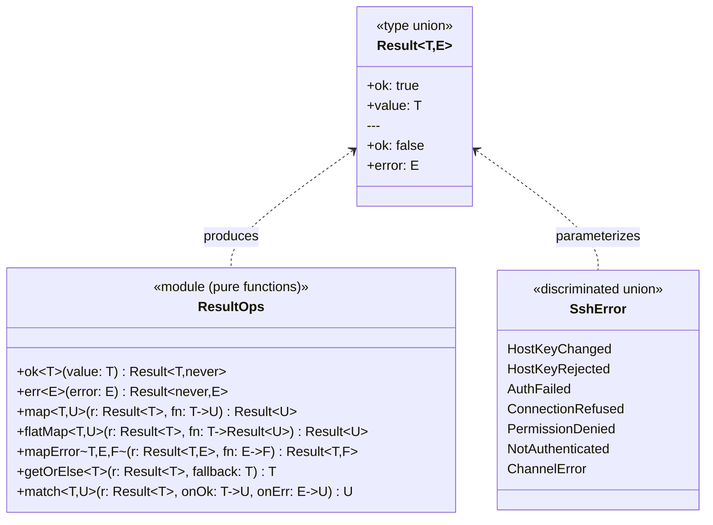

### 2.2 Contrat TypeScript

```typescript
// Discriminated union — type-safe, exhaustive matching
type Result<T, E = SshError> =
  | { readonly ok: true;  readonly value: T }
  | { readonly ok: false; readonly error: E }

// Pure constructors
const ok  = <T>(value: T): Result<T, never> => ({ ok: true,  value })
const err = <E>(error: E): Result<never, E> => ({ ok: false, error })

// Monadic combinators — all pure, zero side effects
const map = <T, U, E>(
  result: Result<T, E>,
  fn: (value: T) => U,
): Result<U, E> =>
  result.ok ? ok(fn(result.value)) : result

const flatMap = <T, U, E>(
  result: Result<T, E>,
  fn: (value: T) => Result<U, E>,
): Result<U, E> =>
  result.ok ? fn(result.value) : result

// Example usage — chaining without try/catch
const transferFile = (session: ISftpFileSystem, path: string): Result<string> =>
  flatMap(session.stat(path),   attrs =>
  flatMap(checkReadable(attrs), _     =>
  session.readFile(path)))
```

### 2.3 Type d'erreur SSH discrimine

```typescript
type SshError =
  | { kind: 'HOST_KEY_CHANGED';    host: string; expected: string; got: string }
  | { kind: 'HOST_KEY_REJECTED';   host: string; fingerprint: string }
  | { kind: 'AUTH_FAILED';         user: string; attemptsLeft: number }
  | { kind: 'CONNECTION_REFUSED';  host: string; port: number }
  | { kind: 'PERMISSION_DENIED';   path: string; operation: string }
  | { kind: 'NOT_AUTHENTICATED' }
  | { kind: 'CHANNEL_ERROR';       channelId: number; message: string }
  | { kind: 'UNKNOWN_OP';          op: string }
```

---

## 3. Value Objects et utilitaires purs (FP)

> **Pourquoi** : Les value objects sont **immuables** et **comparables par valeur**, non par reference. Ils encapsulent leur validation. Les utilitaires purs sont testables sans mock.

### 3.1 Diagramme

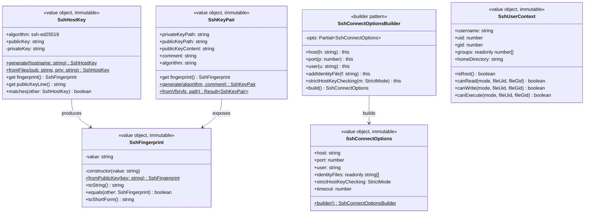

### 3.2 Utilitaires purs (module fonctionnel)

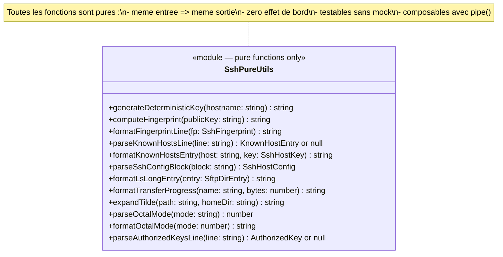

### 3.3 Principe : fonctions composables avec `pipe`

```typescript
// pipe() — compose pure transformations gauche->droite
const pipe = <A, B, C, D>(
  fn1: (a: A) => B,
  fn2: (b: B) => C,
  fn3: (c: C) => D,
) => (a: A): D => fn3(fn2(fn1(a)))

// Exemple : construire une ligne known_hosts depuis un hostname brut
const buildKnownHostsEntry = pipe(
  normalizeHostname,           // "192.168.1.10" -> "192.168.1.10"
  generateDeterministicKey,    // hostname -> publicKey (pure, deterministe)
  (key) => formatKnownHostsEntry(key.host, key),
)
// buildKnownHostsEntry("192.168.1.10") => "192.168.1.10 ssh-ed25519 AAAA..."
```

---

## 4. Subsysteme authentification — Strategy Pattern

> **Pourquoi Strategy** : L'algorithme d'authentification varie (password, publickey, keyboard-interactive) sans que le code appelant (`SshSession`) ne change. Chaque methode est isolee, testable, extensible.
> **Open/Closed** : Ajouter GSSAPI ou `keyboard-interactive` = ajouter une classe, zero modification de `SshSession`.

### 4.1 Diagramme

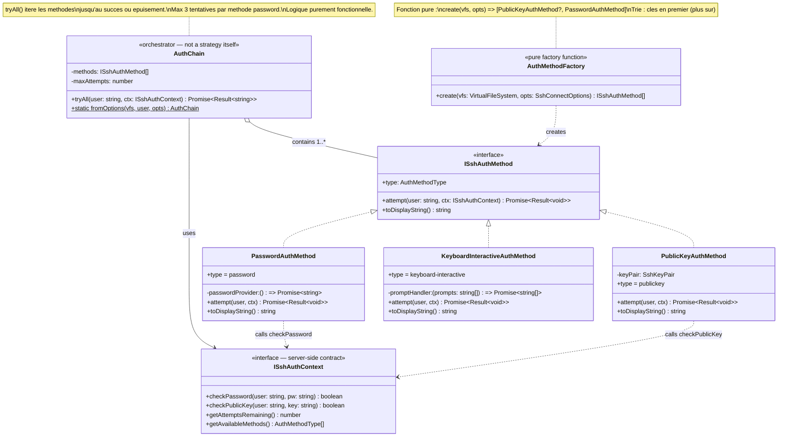

### 4.2 Sequence d'authentification

```
SshSession.connect()
    |
    v
AuthChain.tryAll(user, ctx)
    |
    +-- PublicKeyAuthMethod.attempt()
    |       |-- vfs.readFile('~/.ssh/id_ed25519.pub')  [pure read]
    |       |-- ctx.checkPublicKey(user, pubKey)
    |       |-- ok -> return Result.ok()
    |       `-- fail -> continue chain
    |
    +-- PasswordAuthMethod.attempt()
    |       |-- passwordProvider()  [async: prompts user]
    |       |-- ctx.checkPassword(user, password)
    |       |-- ok -> return Result.ok()
    |       |-- fail, attemptsLeft > 0 -> retry
    |       `-- fail, attemptsLeft = 0 -> return Result.err(AUTH_FAILED)
    |
    `-- Return Result.err(AUTH_FAILED) si toutes les methodes echouent
```

### 4.3 Contrat TypeScript

```typescript
// ISshAuthMethod — SRP : une classe = une methode d'auth
interface ISshAuthMethod {
  readonly type: 'password' | 'publickey' | 'keyboard-interactive'
  attempt(user: string, ctx: ISshAuthContext): Promise<Result<void>>
  toDisplayString(): string  // "publickey,password" dans le message d'erreur
}

// AuthChain — pure orchestration, pas de logique d'auth
class AuthChain {
  private constructor(
    private readonly methods: readonly ISshAuthMethod[],
    private readonly maxPasswordAttempts = 3,
  ) {}

  // Factory function (DI : les strategies sont injectees)
  static create(methods: readonly ISshAuthMethod[]): AuthChain

  async tryAll(user: string, ctx: ISshAuthContext): Promise<Result<void>> {
    for (const method of this.methods) {
      const result = await method.attempt(user, ctx)
      if (result.ok) return result
    }
    return err({ kind: 'AUTH_FAILED', user, attemptsLeft: 0 })
  }
}

// Pure factory — no side effects, deterministic
const createAuthMethods = (
  vfs: VirtualFileSystem,
  opts: SshConnectOptions,
): ISshAuthMethod[] => {
  const methods: ISshAuthMethod[] = []
  // Try public keys first (safer, no brute force risk)
  for (const keyPath of opts.identityFiles) {
    const pair = SshKeyPair.fromVfs(vfs, keyPath)
    if (pair.ok) methods.push(new PublicKeyAuthMethod(pair.value))
  }
  methods.push(new PasswordAuthMethod(opts.passwordProvider))
  return methods
}
```

---

## 5. Verification host key — Strategy + Pure Functions

> **Pourquoi Strategy** : Le comportement de verification varie selon `StrictHostKeyChecking` (yes/no/accept-new). L'algorithme est interchangeable sans modifier `SshSession`.  
> **Pure functions** : Le parsing et l'ecriture de `known_hosts` sont des transformations pures sur des strings.

### 5.1 Diagramme

```mermaid
classDiagram
    class IHostKeyVerificationStrategy {
        <<interface>>
        +verify(host: string, key: SshHostKey, store: KnownHostsStore) VerificationDecision
    }

    class StrictVerificationStrategy {
        +verify(host, key, store) VerificationDecision
    }
    note for StrictVerificationStrategy "StrictHostKeyChecking=yes\nHost inconnu -> PROMPT\nHost connu, cle differente -> REJECT\nHost connu, cle identique -> ACCEPT_SILENT"

    class AcceptNewVerificationStrategy {
        +verify(host, key, store) VerificationDecision
    }
    note for AcceptNewVerificationStrategy "StrictHostKeyChecking=accept-new\nHost inconnu -> ACCEPT_AND_SAVE (sans prompt)\nHost connu, cle differente -> REJECT\nHost connu, cle identique -> ACCEPT_SILENT"

    class NoVerificationStrategy {
        +verify(host, key, store) VerificationDecision
    }
    note for NoVerificationStrategy "StrictHostKeyChecking=no\nToujours -> ACCEPT_SILENT\nAucune ecriture dans known_hosts"

    class VerificationDecision {
        <<discriminated union>>
        ACCEPT_SILENT
        ACCEPT_AND_SAVE
        PROMPT ~fingerprint, host~
        REJECT ~reason, warningBlock~
    }

    class KnownHostsStore {
        <<pure data layer>>
        -entries: ReadonlyMap~string, SshHostKey~
        +get(host: string) SshHostKey or undefined
        +has(host: string) boolean
        +with(host: string, key: SshHostKey) KnownHostsStore
        +parse(content: string)$ KnownHostsStore
        +serialize() string
    }

    class SshKnownHosts {
        <<I/O boundary — single responsibility>>
        -vfs: VirtualFileSystem
        -path: string
        +load() KnownHostsStore
        +save(store: KnownHostsStore) void
        +addHost(host: string, key: SshHostKey) void
    }

    class HostKeyVerificationStrategyFactory {
        <<pure factory function>>
        +create(mode: StrictMode) IHostKeyVerificationStrategy
    }

    IHostKeyVerificationStrategy <|.. StrictVerificationStrategy
    IHostKeyVerificationStrategy <|.. AcceptNewVerificationStrategy
    IHostKeyVerificationStrategy <|.. NoVerificationStrategy
    IHostKeyVerificationStrategy ..> VerificationDecision : returns
    IHostKeyVerificationStrategy ..> KnownHostsStore : reads
    SshKnownHosts --> KnownHostsStore : creates/persists
    HostKeyVerificationStrategyFactory ..> IHostKeyVerificationStrategy : creates

    note for KnownHostsStore "Value object immutable.\nwith() retourne une nouvelle instance\n(pas de mutation).\nparse() et serialize() sont pures."
```

### 5.2 Contrat TypeScript

```typescript
type VerificationDecision =
  | { action: 'accept_silent' }
  | { action: 'accept_and_save'; entry: string }
  | { action: 'prompt'; fingerprint: string; host: string }
  | { action: 'reject'; warningBlock: string; reason: string }

// Pure store — immutable, no I/O
class KnownHostsStore {
  private constructor(
    private readonly entries: ReadonlyMap<string, SshHostKey>,
  ) {}

  static readonly empty = new KnownHostsStore(new Map())

  // Pure — returns new instance
  with(host: string, key: SshHostKey): KnownHostsStore {
    return new KnownHostsStore(new Map([...this.entries, [host, key]]))
  }

  // Pure parsing (no side effects)
  static parse(content: string): KnownHostsStore {
    const entries = content
      .split('\n')
      .filter(line => line.trim() && !line.startsWith('#'))
      .reduce((map, line) => {
        const parsed = parseKnownHostsLine(line)  // pure util
        return parsed ? map.set(parsed.host, parsed.key) : map
      }, new Map<string, SshHostKey>())
    return new KnownHostsStore(entries)
  }

  // Pure serialization
  serialize(): string {
    return [...this.entries.entries()]
      .map(([host, key]) => formatKnownHostsEntry(host, key))  // pure util
      .join('\n')
  }
}

// Strategy — OCP : nouvelle strategie sans modifier SshSession
const createVerificationStrategy = (
  mode: 'yes' | 'no' | 'accept-new',
): IHostKeyVerificationStrategy => ({
  'yes':        new StrictVerificationStrategy(),
  'no':         new NoVerificationStrategy(),
  'accept-new': new AcceptNewVerificationStrategy(),
}[mode])
```

---

## 6. Session SSH — Facade + State Machine + Builder

> **Pourquoi Facade** : `SshSession` presente une interface simple (`connect`, `openShellChannel`, `openSftpChannel`) tout en orchestrant la complexite interne (host key, auth chain, canaux). Les appelants (`LinuxTerminalSession`, `SftpSession`) ne voient pas les details du protocole.  
> **State Machine (FP)** : L'etat de connexion est un discriminated union immutable. Chaque transition retourne un nouvel etat, rendant les transitions tracables et testables.

### 6.1 Diagramme de classe

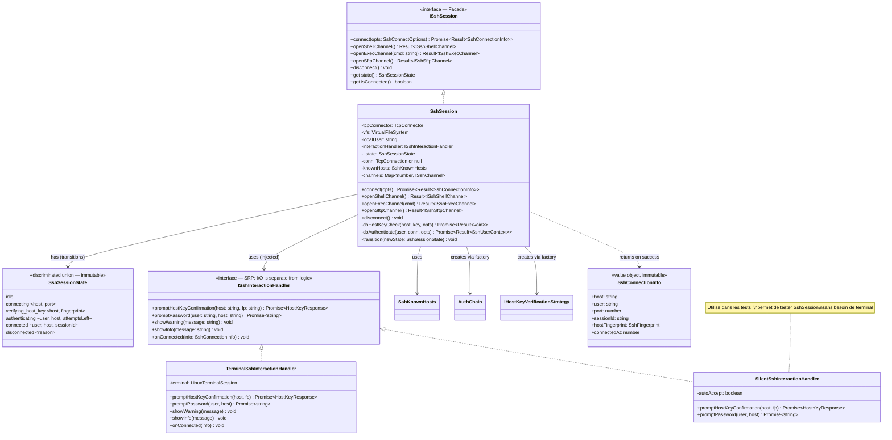

### 6.2 State machine — transitions

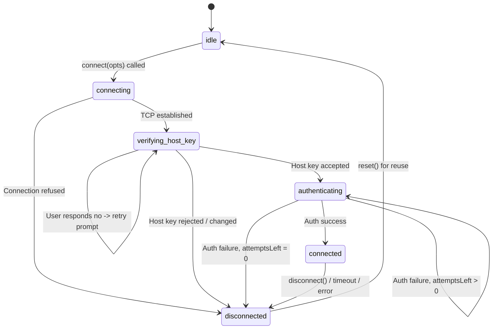

### 6.3 Builder pour les options de connexion

```typescript
// SRP : construction des options separee de leur utilisation
// OCP : nouvelles options => ajouter methode sur Builder, pas modifier SshSession
class SshConnectOptionsBuilder {
  private opts: Partial<SshConnectOptions> = {
    port: 22,
    identityFiles: [],
    strictHostKeyChecking: 'yes',
  }

  host(h: string): this            { this.opts.host = h; return this }
  port(p: number): this            { this.opts.port = p; return this }
  user(u: string): this            { this.opts.user = u; return this }
  addIdentityFile(f: string): this { this.opts.identityFiles!.push(f); return this }
  strict(m: StrictMode): this      { this.opts.strictHostKeyChecking = m; return this }

  build(): SshConnectOptions {
    if (!this.opts.host) throw new Error('host is required')
    if (!this.opts.user) throw new Error('user is required')
    return Object.freeze({ ...this.opts }) as SshConnectOptions  // immutable
  }
}

// Usage :
const opts = SshConnectOptions.builder()
  .host('192.168.1.10')
  .user('alice')
  .port(22)
  .addIdentityFile('~/.ssh/id_ed25519')
  .strict('accept-new')
  .build()
```

---

## 7. Canaux SSH — Template Method + Composite

> **Pourquoi Template Method** : Tous les canaux partagent un cycle de vie (open → use → close). La structure est definie dans `AbstractSshChannel`, les variantes (shell, exec, sftp) surchargent uniquement les etapes specifiques.  
> **Composite** : Une `SshSession` gere une collection de canaux. Fermer la session ferme tous les canaux.

### 7.1 Diagramme

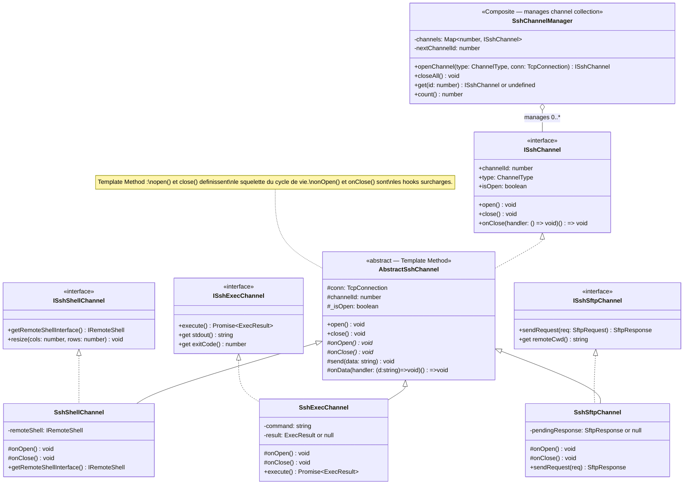

### 7.2 Template Method — cycle de vie d'un canal

```typescript
abstract class AbstractSshChannel implements ISshChannel {
  protected _isOpen = false

  // TEMPLATE METHOD — structure fixe, hooks variables
  open(): void {
    if (this._isOpen) return
    this._isOpen = true
    this.onOpen()    // hook — specifique a chaque canal
  }

  close(): void {
    if (!this._isOpen) return
    this._isOpen = false
    this.onClose()   // hook — cleanup specifique
    this.closeHandlers.forEach(h => h())
  }

  // Hooks abstraits — Liskov : chaque sous-classe implemente correctement
  protected abstract onOpen(): void
  protected abstract onClose(): void
}

class SshSftpChannel extends AbstractSshChannel {
  readonly type = 'sftp' as const

  protected onOpen(): void {
    // Enregistrer le handler SFTP sur la connexion
    this.off = this.conn.onData((data) => {
      this.pendingResponse = JSON.parse(data)
    })
  }

  protected onClose(): void {
    this.off?.()
    this.pendingResponse = null
  }

  // Synchronous request/response (simulator invariant)
  sendRequest(req: SftpRequest): SftpResponse {
    if (!this._isOpen) throw new Error('Channel not open')
    this.conn.write(JSON.stringify(req))
    return this.pendingResponse ?? { ok: false, error: 'No response' }
  }
}
```

---

## 8. Serveur SSH — Command + Observer

> **Pourquoi Command** : Chaque operation SFTP est un objet commande avec `execute()`. Le `SftpServerHandler` dispatch sans connaitre les details de chaque operation. Ajouter une operation = ajouter une classe, sans modifier le dispatcher.  
> **Pourquoi Observer** : Le serveur emet des evenements (connexion etablie, auth ok, canal ouvert) que les composants interesses peuvent observer sans couplage direct.

### 8.1 Diagramme — ISshServerContext et SshServerHandler

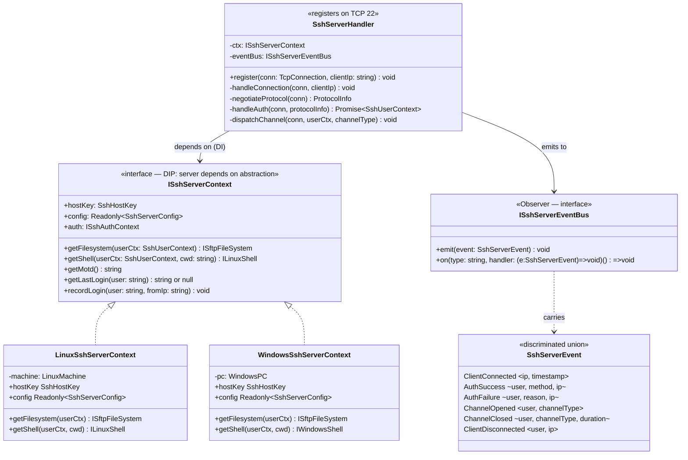

### 8.2 Diagramme — Command Pattern pour SFTP

```mermaid
classDiagram
    class ISftpCommand~T~ {
        <<interface — Command Pattern>>
        +op: string
        +execute(req: SftpRequest, ctx: SftpCommandContext) Result~T~
    }

    class SftpCommandContext {
        <<value object — immutable per request>>
        +vfs: ISftpFileSystem
        +userCtx: SshUserContext
        +cwd: string
    }

    class SftpGetCommand {
        +op = get
        +execute(req, ctx) Result~SftpFileContent~
    }
    note for SftpGetCommand "1. normalizePath\n2. getEntryType\n3. checkReadPermission\n4. readFile\nRetourne Result, jamais throw"

    class SftpPutCommand {
        +op = put
        +execute(req, ctx) Result~void~
    }
    note for SftpPutCommand "1. normalizePath\n2. checkWritePermission sur parent\n3. writeFile\n4. Propage Result.err si echec"

    class SftpLsCommand {
        +op = ls
        +execute(req, ctx) Result~SftpDirEntry[]~
    }
    note for SftpLsCommand "Retourne attributs complets\n(mode, uid, gid, size, mtime)\npour ls -l"

    class SftpMkdirCommand {
        +op = mkdir
        +execute(req, ctx) Result~void~
    }
    note for SftpMkdirCommand "mkdir NON-recursif :\nverifie existence parent,\nechoue si parent absent"

    class SftpRmCommand {
        +op = rm
        +execute(req, ctx) Result~void~
    }
    class SftpRmdirCommand {
        +op = rmdir
        +execute(req, ctx) Result~void~
    }
    class SftpRenameCommand {
        +op = rename
        +execute(req, ctx) Result~void~
    }
    note for SftpRenameCommand "Verifie destination absente\navant de renommer (SFTP v3)"

    class SftpChmodCommand {
        +op = chmod
        +execute(req, ctx) Result~void~
    }
    class SftpStatCommand {
        +op = stat
        +execute(req, ctx) Result~SftpFileAttrs~
    }

    class SftpCommandDispatcher {
        <<Open/Closed core>>
        -registry: ReadonlyMap~string, ISftpCommand~
        +dispatch(op: string, req, ctx) Result~unknown~
        +static build(commands: ISftpCommand[])$ SftpCommandDispatcher
    }

    ISftpCommand <|.. SftpGetCommand
    ISftpCommand <|.. SftpPutCommand
    ISftpCommand <|.. SftpLsCommand
    ISftpCommand <|.. SftpMkdirCommand
    ISftpCommand <|.. SftpRmCommand
    ISftpCommand <|.. SftpRmdirCommand
    ISftpCommand <|.. SftpRenameCommand
    ISftpCommand <|.. SftpChmodCommand
    ISftpCommand <|.. SftpStatCommand
    SftpCommandDispatcher o-- ISftpCommand : registry 1..*
    SftpGetCommand --> SftpCommandContext : reads
    SftpPutCommand --> SftpCommandContext : reads

    note for SftpCommandDispatcher "OCP :\nAjouter une commande = enregistrer\nune instance dans le registry.\nZero modification du dispatcher.\n\nnew SftpCommandDispatcher([\n  new SftpGetCommand(),\n  new SftpPutCommand(),\n  // ...\n  new SftpMyNewCommand(), // OCP !\n])"
```

---

## 9. Subsysteme SFTP refactorise — Command + Decorator + ISP

> **Interface Segregation** : `ISftpFileSystem` est decomposee en roles independants. Un composant qui ne fait que lire ne depends pas de `writeFile`.  
> **Decorator** : `PermissionCheckingFSDecorator` ajoute la verification de permissions autour de n'importe quelle implementation de `ISftpFileSystem`, sans modifier les adapters.

### 9.1 Decomposition ISftpFileSystem (Interface Segregation)

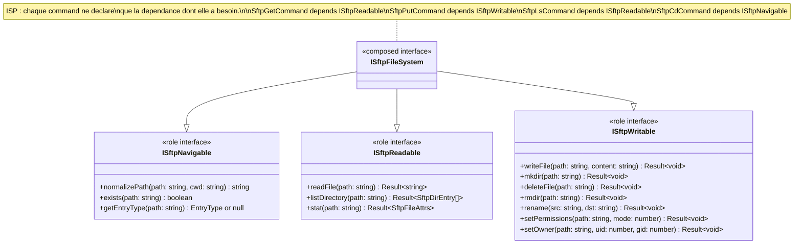

### 9.2 Decorator — controle de permissions

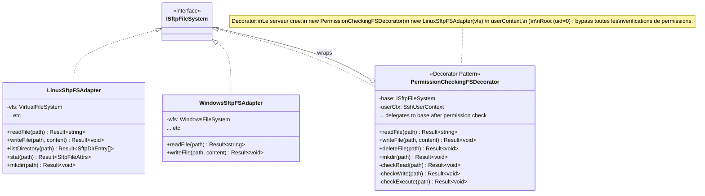

### 9.3 Diagramme complet SFTP refactorise

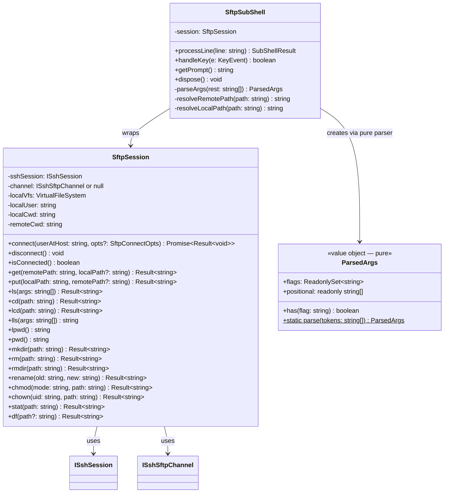

---

## 10. Integration et flux complets

### 10.1 Flux complet : `ssh alice@192.168.1.10` (premier connect)

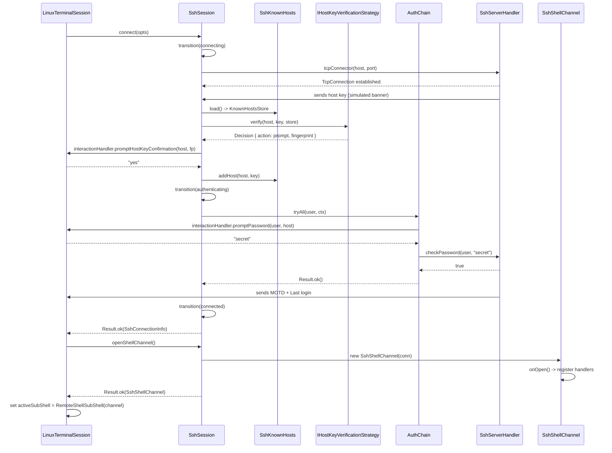

### 10.2 Flux complet : `sftp alice@192.168.1.10` + `get /etc/passwd`

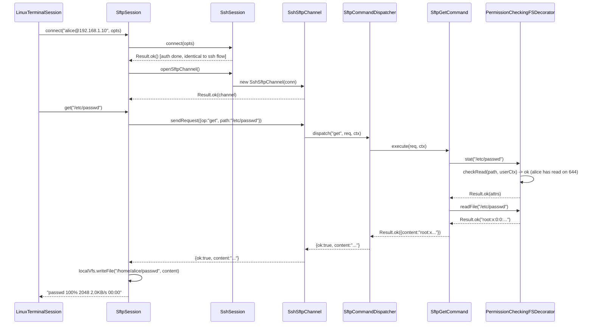

### 10.3 Flux : `get /etc/shadow` par utilisateur non-root

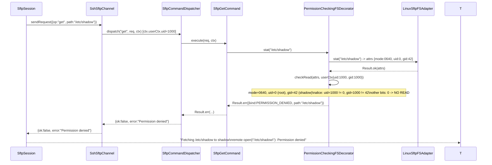

---

## 11. Recapitulatif des principes appliques

### 11.1 SOLID — mapping complet

| Principe | Application concrete |
|---|---|
| **S** — Single Responsibility | `SshHostKey` signe seulement. `SshKnownHosts` persiste seulement. `AuthChain` orchestre seulement. `PasswordAuthMethod` authentifie par mot de passe seulement. `SftpGetCommand` telecharg seulement. |
| **O** — Open/Closed | `SftpCommandDispatcher` : ajouter une commande = instancier une classe. `AuthChain` : nouvelle methode d'auth = nouvelle classe. `IHostKeyVerificationStrategy` : nouveau mode = nouvelle classe. Zero modification du code existant dans les trois cas. |
| **L** — Liskov Substitution | `LinuxSftpFSAdapter` et `WindowsSftpFSAdapter` sont interchangeables via `ISftpFileSystem`. `PermissionCheckingFSDecorator` est substituable partout ou `ISftpFileSystem` est attendu. `SilentSshInteractionHandler` substituable a `TerminalSshInteractionHandler` dans les tests. |
| **I** — Interface Segregation | `ISftpReadable`, `ISftpWritable`, `ISftpNavigable` : chaque commande ne depend que du role dont elle a besoin. `SftpGetCommand` ne depend que de `ISftpReadable`, pas de l'interface entiere. |
| **D** — Dependency Inversion | `SshSession` depend de `ISshInteractionHandler`, `TcpConnector`, `IHostKeyVerificationStrategy` — jamais de `LinuxTerminalSession` ou de `TcpConnection` directement. `SftpCommandDispatcher` depend de `ISftpCommand[]`, pas des classes concretes. |

### 11.2 Design Patterns — recapitulatif

| Pattern | Classe(s) | Probleme resolu |
|---|---|---|
| **Strategy** | `ISshAuthMethod`, `IHostKeyVerificationStrategy` | Interchangeabilite des algorithmes d'auth et de verification |
| **Facade** | `SshSession`, `SftpSession` | Interface simple sur protocoles complexes |
| **Builder** | `SshConnectOptionsBuilder` | Construction d'objets immutables avec validation |
| **Template Method** | `AbstractSshChannel` | Cycle de vie partage, variantes specifiees dans les sous-classes |
| **Command** | `ISftpCommand`, `SftpCommandDispatcher` | Encapsulation des operations SFTP, OCP garanti |
| **Decorator** | `PermissionCheckingFSDecorator` | Ajout de comportement (permissions) sans modification des adapters |
| **Composite** | `SshChannelManager` | Gestion d'une collection de canaux, fermeture en cascade |
| **Factory Method** | `createAuthMethods()`, `createVerificationStrategy()` | Creation d'objets sans couplage aux implementations concretes |
| **Observer** | `ISshServerEventBus` | Decouplage entre le serveur et les composants qui observent les evenements |
| **Adapter** | `LinuxSftpFSAdapter`, `WindowsSftpFSAdapter`, `LinuxSshServerContext`, `WindowsSshServerContext` | Adaptateurs entre interfaces SSH/SFTP et classes de devices existantes |

### 11.3 Programmation fonctionnelle — apports concrets

| Concept FP | Application | Benefice |
|---|---|---|
| **Immutabilite** | `SshConnectOptions`, `SshHostKey`, `SshFingerprint`, `KnownHostsStore`, `SshSessionState` | Pas d'etat partage mutable. Les bugs de concurrence disparaissent. |
| **Fonctions pures** | `SshPureUtils.*`, `KnownHostsStore.parse()`, `KnownHostsStore.serialize()`, `ParsedArgs.parse()`, `formatTransferProgress()` | Testables sans mock, reproductibles, composables. |
| **Result monad** | Tous les retours d'operations pouvant echouer | Pas d'exceptions dans le flux de controle. Les erreurs sont des valeurs. |
| **Discriminated unions** | `SshSessionState`, `SshError`, `VerificationDecision`, `SshServerEvent` | Exhaustivite garantie par le compilateur TypeScript (`switch` sans default). |
| **Higher-order functions** | `AuthChain.tryAll()`, `SftpCommandDispatcher.dispatch()`, `pipe()` | Composition sans heritage. Logique metier separee de l'iteration. |
| **Currying / partial application** | `createVerificationStrategy(mode)`, `createAuthMethods(vfs, opts)` | Factories pures sans classes. Configuration separee de l'execution. |

### 11.4 Guide de correspondance BRD -> Design

| Requirement BRD | Design |
|---|---|
| SSH-01 (host key) | `SshHostKey`, `SshKnownHosts`, `IHostKeyVerificationStrategy` (Strategy) |
| SSH-02 (auth password) | `PasswordAuthMethod` (Strategy), `AuthChain` |
| SSH-03 (auth publickey) | `PublicKeyAuthMethod` (Strategy), `SshKeyPair`, `SshAuthorizedKeys` |
| SSH-04 (session interactive) | `SshShellChannel` (Template Method), `ISshInteractionHandler` |
| SSH-05 (exec non-interactif) | `SshExecChannel` (Template Method) |
| SSH-06 (ssh config) | `SshConfig` (pure parser), `SshConnectOptionsBuilder` (Builder) |
| SSH-07 (sshd) | `SshServerHandler` (Observer), `ISshServerContext` (Adapter) |
| SSH-08 (scp) | `SshExecChannel` reutilise + `ISftpFileSystem` pour la lecture/ecriture |
| SFTP-03 (put erreurs) | `SftpPutCommand.execute()` retourne `Result.err` si `writeFile` echoue |
| SFTP-04 (mkdir non-recursif) | `SftpMkdirCommand` utilise `ISftpWritable.mkdir` (non-recursif) |
| SFTP-05 (rename protege) | `SftpRenameCommand` verifie existence avant de renommer |
| SFTP-06 (ls -l) | `SftpLsCommand` retourne `SftpDirEntry[]` avec attributs ; `ParsedArgs` detecte `-l` |
| SFTP-12 (flags CLI) | `ParsedArgs.parse(tokens)` (pure function), `SftpSubShell` l'utilise |
| SFTP-20 (permissions) | `PermissionCheckingFSDecorator` (Decorator), `SshUserContext.canRead/Write` |

---

*Document genere le 2026-05-05 — a maintenir en sync avec l'implementation*
