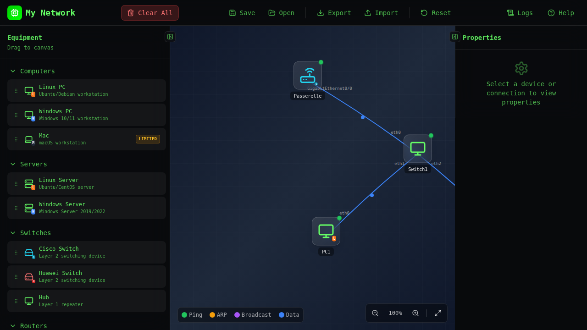
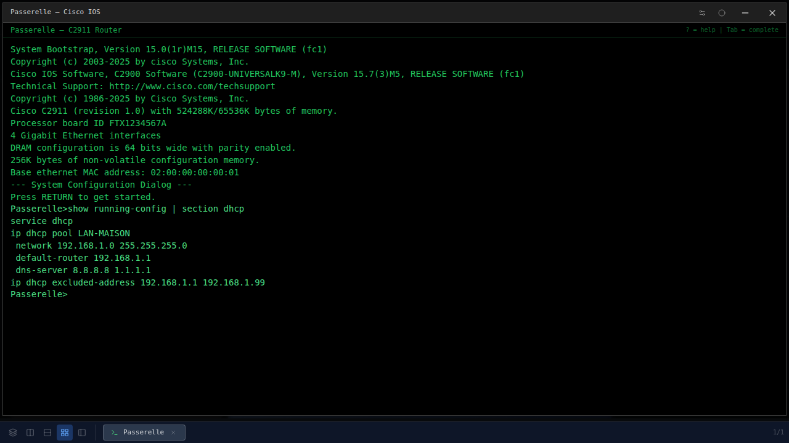
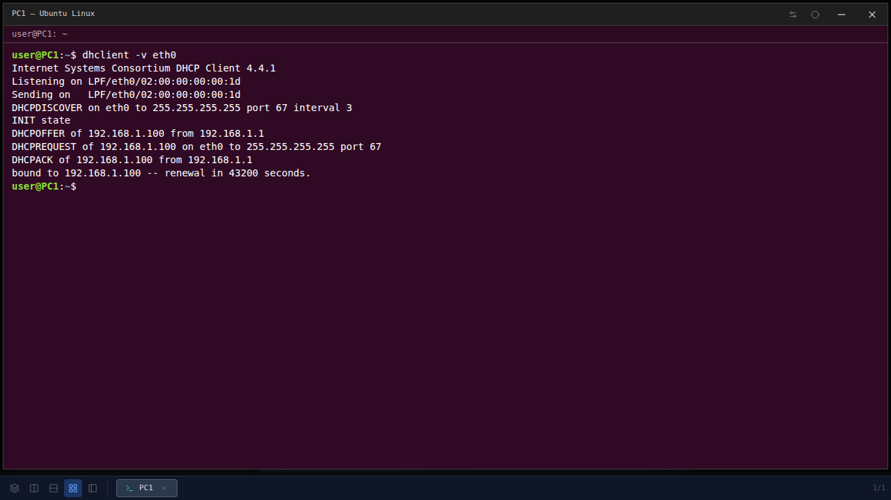
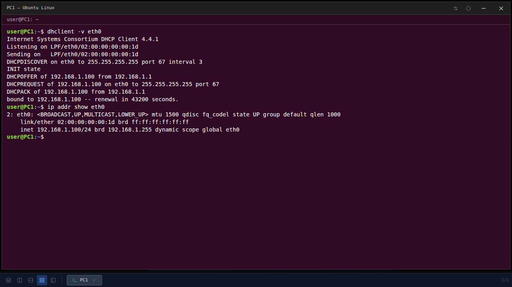
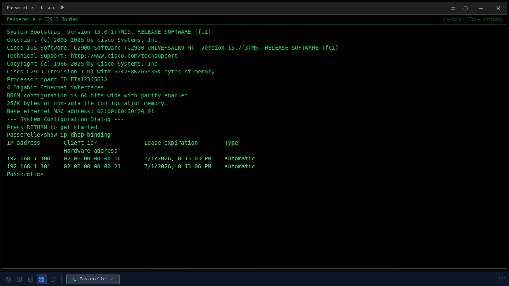
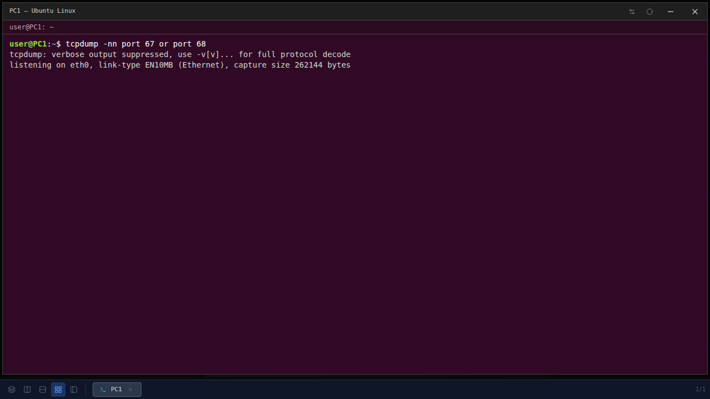

# DHCP de Zéro à Héros : Comment vos machines obtiennent leur IP toutes seules

> **À qui s'adresse ce tutoriel ?**
> Si tu sais ce qu'est une adresse IP et que tu reconnais un câble RJ-45, tu es bien équipé. Pas besoin d'avoir déjà touché à un routeur — on construit ensemble, pas à pas, dans le simulateur. 🧱

---

## Table des matières

1. [Le problème que résout DHCP](#1-le-problème-que-résout-dhcp)
2. [Comment DHCP fonctionne en coulisses : le bal DORA](#2-comment-dhcp-fonctionne-en-coulisses--le-bal-dora)
3. [Notre laboratoire](#3-notre-laboratoire)
4. [Configurer le serveur DHCP sur un routeur Cisco](#4-configurer-le-serveur-dhcp-sur-un-routeur-cisco)
5. [Demander un bail depuis un PC Linux](#5-demander-un-bail-depuis-un-pc-linux)
6. [Vérifier côté serveur : les bindings](#6-vérifier-côté-serveur--les-bindings)
7. [Capturer le trafic DHCP au wire](#7-capturer-le-trafic-dhcp-au-wire)
8. [Renouveler, libérer, dépanner](#8-renouveler-libérer-dépanner)
9. [Les pièges classiques](#9-les-pièges-classiques)
10. [Conclusion](#10-conclusion)

---

## 1. Le problème que résout DHCP

Imagine un hôtel : 200 chambres, des arrivées toutes les minutes. Si tu obligeais chaque client à choisir son numéro de chambre, à l'inscrire dans le registre, à vérifier que personne d'autre ne l'a déjà, ce serait le chaos. Un réseau d'entreprise, c'est pareil. Sans DHCP, il faudrait écrire à la main, sur chaque PC, sur chaque imprimante, sur chaque téléphone IP :

- l'**adresse IP** (l'identité sur le réseau),
- le **masque de sous-réseau** (la taille du réseau),
- la **passerelle par défaut** (la sortie vers le reste du monde),
- le **serveur DNS** (le traducteur de noms vers IP).

Quatre lignes par appareil. Multiplie par 50 PC, dix imprimantes, vingt smartphones… et fais-le à nouveau dès qu'un sous-réseau change. 😱

**DHCP** (*Dynamic Host Configuration Protocol*, RFC 2131) résout ce problème en faisant **distribuer ces informations par un serveur**. La machine qui démarre demande « salut, j'ai besoin d'une IP », un serveur lui répond « tiens, prends celle-ci, voici aussi ta passerelle et ton DNS, ton bail dure 24 heures », et c'est terminé. Aucune intervention humaine.

---

## 2. Comment DHCP fonctionne en coulisses : le bal DORA

Quand un client DHCP réclame une adresse, il joue toujours la même chorégraphie en quatre temps. On l'appelle **DORA** — l'acronyme parfait pour la retenir :

| Étape | Émetteur | Type de message | Ce qui se passe |
|---|---|---|---|
| **D** | Client | `DHCPDISCOVER` | « Y a-t-il un serveur DHCP qui m'entend ? » — broadcast UDP 255.255.255.255 |
| **O** | Serveur | `DHCPOFFER` | « Oui, je te propose 192.168.1.100, avec ce masque, cette passerelle… » |
| **R** | Client | `DHCPREQUEST` | « OK, je veux celle-là » — toujours en broadcast (pour informer les autres serveurs qu'il choisit) |
| **A** | Serveur | `DHCPACK` | « Confirmé, l'adresse est à toi pour N secondes » |

Tout ça circule en **UDP** : le serveur écoute sur le port **67**, le client sur le **68**. Les premiers messages partent en broadcast parce que le client n'a justement pas encore d'IP — il ne peut pas faire de l'unicast.

Au bout du bail, le client doit **renouveler** (souvent à 50 % de la durée), sinon l'adresse est rendue au pot commun.

C'est tout. Quatre paquets, et la magie opère. Place à la pratique. 🎯

---

## 3. Notre laboratoire

On va monter le laboratoire le plus simple possible : **un routeur Cisco** qui joue le serveur DHCP, **un switch** au milieu, et **deux PC Linux** clients qui vont chacun demander un bail.



Pour le reproduire dans le simulateur :

1. Glisse-dépose un **routeur Cisco** depuis la palette. Renomme-le `Passerelle`.
2. Glisse-dépose un **switch générique**.
3. Glisse-dépose **deux PC Linux** (`PC-1`, `PC-2`).
4. Tire un câble du routeur vers le switch, puis un câble de chaque PC vers le switch.

Plan d'adressage prévu :

| Élément | IP | Rôle |
|---|---|---|
| Routeur `Passerelle` (G0/0) | `192.168.1.1/24` | Passerelle + serveur DHCP |
| Pool DHCP | `192.168.1.100 → 192.168.1.254` | Bail attribué aux PC |
| Exclusion | `192.168.1.1 → 192.168.1.99` | Plage réservée aux statiques |
| PC-1, PC-2 | DHCP | Clients |

Note l'**exclusion** : on dit explicitement au routeur de ne pas donner les 99 premières adresses. C'est une bonne pratique pour garder une plage pour les appareils statiques (imprimantes, serveurs…).

---

## 4. Configurer le serveur DHCP sur un routeur Cisco

Double-clique sur le routeur `Passerelle` pour ouvrir son terminal. On va d'abord donner une IP à son interface, puis créer le pool DHCP.

```
Router> enable
Router# configure terminal
Router(config)# hostname Passerelle
Passerelle(config)# interface GigabitEthernet0/0
Passerelle(config-if)# ip address 192.168.1.1 255.255.255.0
Passerelle(config-if)# no shutdown
Passerelle(config-if)# exit
Passerelle(config)# ip dhcp excluded-address 192.168.1.1 192.168.1.99
Passerelle(config)# ip dhcp pool LAN-MAISON
Passerelle(dhcp-config)# network 192.168.1.0 255.255.255.0
Passerelle(dhcp-config)# default-router 192.168.1.1
Passerelle(dhcp-config)# dns-server 8.8.8.8 1.1.1.1
Passerelle(dhcp-config)# lease 1
Passerelle(dhcp-config)# end
```

**Décortiquons :**

- `interface … ip address … no shutdown` → on monte l'interface du routeur avec son IP fixe.
- `ip dhcp excluded-address 192.168.1.1 192.168.1.99` → on réserve la plage `.1` à `.99` pour des affectations statiques. Le serveur DHCP ne distribuera que `.100` à `.254`.
- `ip dhcp pool LAN-MAISON` → on entre dans la configuration d'un **pool**. Le nom est libre.
- `network 192.168.1.0 255.255.255.0` → le sous-réseau couvert.
- `default-router 192.168.1.1` → l'**option 3** envoyée aux clients : leur passerelle par défaut.
- `dns-server 8.8.8.8 1.1.1.1` → l'**option 6** : les serveurs DNS. On peut en mettre plusieurs.
- `lease 1` → durée du bail en jours.

Vérifions que la config est en place :

```
Passerelle# show running-config | section dhcp
```



Tout y est : le pool, l'exclusion, les options. Le routeur est **prêt à servir des baux**. 🎉

---

## 5. Demander un bail depuis un PC Linux

Maintenant la partie marrante. Ouvre le terminal de `PC-1` et lance le client ISC en mode verbeux :

```bash
$ dhclient -v eth0
```

L'option `-v` active la sortie verbeuse, qui imprime chaque étape du DORA. Voici ce que le PC voit défiler :



Tu reconnais chaque étape du tableau de la section 2 :

```
Internet Systems Consortium DHCP Client 4.4.1
Listening on LPF/eth0/aa:bb:cc:dd:ee:ff
Sending on   LPF/eth0/aa:bb:cc:dd:ee:ff
DHCPDISCOVER on eth0 to 255.255.255.255 port 67 interval 3
DHCPOFFER of 192.168.1.100 from 192.168.1.1
DHCPREQUEST of 192.168.1.100 on eth0 to 255.255.255.255 port 67
DHCPACK of 192.168.1.100 from 192.168.1.1
bound to 192.168.1.100 -- renewal in 43200 seconds.
```

**Lecture ligne par ligne :**

- `DHCPDISCOVER … 255.255.255.255 port 67` : broadcast pur, le client ne sait pas encore qui répondra.
- `DHCPOFFER of 192.168.1.100 from 192.168.1.1` : la `Passerelle` propose la première IP libre du pool, soit `.100` (les `.1` à `.99` sont exclus).
- `DHCPREQUEST` : le client confirme officiellement son choix, toujours en broadcast.
- `DHCPACK` : le serveur grave le bail dans sa base.
- `bound to 192.168.1.100 -- renewal in 43200 seconds` → le client a son IP, et il prévoit déjà de **renouveler** à 12h pile (la moitié des 86 400 secondes du bail d'un jour).

Vérifions que la pile réseau a bien intégré l'IP :

```bash
$ ip addr show eth0
```



`inet 192.168.1.100/24` : c'est exactement l'IP annoncée par le `DHCPACK`. Le PC est **opérationnel sur le réseau** sans qu'on lui ait jamais dit quoi écrire dans `/etc/network/interfaces`. C'est ça la promesse de DHCP. ✨

Refais la même opération sur `PC-2` (`dhclient -v eth0` dans son terminal). Tu verras le bail `192.168.1.101` lui être attribué — l'IP suivante dans le pool.

---

## 6. Vérifier côté serveur : les bindings

Le routeur garde la liste de **tous les baux actifs** dans sa table de bindings. C'est l'équivalent de la fiche de réception de l'hôtel : qui a quelle chambre, jusqu'à quand. On la consulte avec :

```
Passerelle# show ip dhcp binding
```



Trois colonnes clés à comprendre :

- **IP address** — l'adresse louée.
- **Client-ID / Hardware address** — l'identifiant du client. Sur Ethernet, c'est l'adresse MAC précédée d'un `01` (qui code le type « ethernet »).
- **Lease expiration** — quand le bail expire si le client ne le renouvelle pas.

C'est cette table que tu interrogeras le jour où un utilisateur dira « je n'arrive pas à imprimer sur 192.168.1.105 ». Tu chercheras `.105` dans les bindings, tu liras la MAC, tu sauras qui c'est. Idem pour les baux qui ne se libèrent pas : on cible l'IP, on la rend disponible avec `clear ip dhcp binding <ip>`.

---

## 7. Capturer le trafic DHCP au wire

Le bal DORA n'est pas qu'un récit pédagogique : il se voit, octet par octet, sur le câble. Lance un **tcpdump** sur `PC-1` filtré sur les ports DHCP :

```bash
$ tcpdump -nn port 67 or port 68
```



Les quatre segments sont là, dans l'ordre, avec :

- **source 0.0.0.0:68 → destination 255.255.255.255:67** pour le DISCOVER et le REQUEST (le client n'a pas encore d'IP ou la confirme),
- **source 192.168.1.1:67 → destination 255.255.255.255:68** pour l'OFFER et l'ACK (le serveur diffuse aussi en broadcast tant que le bail n'est pas finalisé).

C'est la vérité du fil : aucune magie, juste de l'UDP qui voyage. Si un jour ton DHCP « ne marche pas », `tcpdump port 67 or port 68` te dira exactement où la chorégraphie s'arrête.

---

## 8. Renouveler, libérer, dépanner

### 8.1 Libérer le bail

Le client peut **rendre son adresse** avant la fin du bail. C'est ce que fait Windows à l'extinction, et c'est aussi utile pour repartir d'un état propre :

```bash
$ sudo dhclient -r eth0
```

L'option `-r` envoie un `DHCPRELEASE`. Sur le routeur, `show ip dhcp binding` voit la ligne disparaître.

### 8.2 Forcer un nouveau bail

```bash
$ sudo dhclient -x eth0   # tue le client courant
$ sudo dhclient    eth0   # repart d'un DHCPDISCOVER
```

C'est le réflexe le plus utile en dépannage : on repart d'un DORA neuf, on relit toutes les options envoyées par le serveur.

### 8.3 Voir le bail mémorisé par le client

Le client ISC garde une trace persistante de chaque bail :

```bash
$ cat /var/lib/dhcp/dhclient.leases
```

Tu y retrouves l'IP, la passerelle, le DNS, la date d'expiration — pratique pour comprendre pourquoi une machine garde une IP zombie après un changement de plan d'adressage.

### 8.4 Les compteurs côté serveur

Sur le routeur :

```
Passerelle# show ip dhcp pool LAN-MAISON
Passerelle# show ip dhcp statistics
```

Le premier indique combien d'adresses sont **louées vs. disponibles**, et où en est le « pointeur de prochaine attribution ». Le second compte les `DISCOVER`/`OFFER`/`REQUEST`/`ACK`/`NAK` reçus et envoyés — un excellent thermomètre quand tu suspectes un client malveillant qui spam.

---

## 9. Les pièges classiques

### 9.1 Le routeur ne sert pas (pas d'OFFER)

Les trois suspects, dans l'ordre :

1. **L'interface n'a pas d'IP dans le réseau du pool.** Le serveur ne peut servir un pool que sur une interface dont l'IP **appartient** au sous-réseau du pool. Vérifie avec `show ip interface brief`.
2. **L'interface est `administratively down`.** Un `no shutdown` qui manque, et il n'y a personne au bout du fil.
3. **Le câble du PC n'arrive pas au switch.** Trivial mais ça vaut la vérification : pas de lien physique = pas de broadcast qui passe.

### 9.2 Le client est dans un autre sous-réseau

DHCP repose sur le **broadcast**. Or les broadcasts s'arrêtent par défaut à la frontière d'un routeur. Si le serveur DHCP est sur le LAN A et que tes clients sont sur le LAN B (de l'autre côté d'un routeur), le DISCOVER n'arrivera jamais.

La solution s'appelle **DHCP relay** : sur l'interface qui voit les clients, on configure un agent de relais qui réémet le DISCOVER en unicast vers le serveur :

```
Routeur(config)# interface GigabitEthernet0/1
Routeur(config-if)# ip helper-address 192.168.1.1
```

`ip helper-address 192.168.1.1` dit : « tout broadcast DHCP qui entre par cette interface, transforme-le en unicast vers 192.168.1.1 ». C'est exactement comme ça que ça se passe en entreprise : un serveur DHCP central, des relais sur chaque routeur d'accès.

### 9.3 Deux serveurs DHCP sur le même réseau

C'est la **rogue DHCP attack**, ou simplement l'erreur de débutant. Si deux serveurs proposent des baux, c'est le plus rapide qui gagne — et tes clients héritent parfois d'une mauvaise passerelle, voire d'un DNS malveillant. En production, on protège avec **DHCP snooping** sur les switches, qui ne laisse passer les `OFFER`/`ACK` que depuis des ports déclarés « trusted ». Mais à l'échelle d'un labo, il suffit de ne pas oublier de couper l'ancien serveur quand on en monte un nouveau.

### 9.4 Le pool est saturé

Tôt ou tard, ça arrive. `show ip dhcp pool` te le dit : `Leased addresses: 154`, `Excluded addresses: 99`, `Total addresses: 254` — il ne reste rien. Trois leviers :

- raccourcir la **durée des baux** (`lease 0 4` pour 4 heures, par exemple) — utile sur un Wi-Fi public où les clients vont et viennent ;
- **agrandir le sous-réseau** (passer en `/23` au lieu de `/24` double la capacité) ;
- **purger les baux fantômes** avec `clear ip dhcp binding *`.

---

## 10. Conclusion

Tu sais maintenant **ce que DHCP fait, pourquoi, et comment le mettre en place de bout en bout**. Reprenons les acquis :

- DHCP automatise la distribution d'**IP, masque, passerelle, DNS** — sans lui, l'admin réseau passerait sa vie à taper des `ip address` à la main.
- La chorégraphie **DORA** (Discover, Offer, Request, Ack) est le cœur du protocole. Garde-la en tête : à chaque problème DHCP, tu te demanderas « jusqu'où le bal va-t-il ? ».
- Côté routeur Cisco, tout tient en quelques lignes : une IP d'interface, un `ip dhcp pool`, un `network`, un `default-router`, un `dns-server`, et c'est servi.
- Côté client Linux, `dhclient -v` te raconte chaque étape. `ip addr` montre le résultat. `tcpdump port 67 or port 68` te montre le câble.
- Pour traverser des sous-réseaux, **ip helper-address** : la passerelle entre en jeu et relaie les broadcasts.

Le plus dur en DHCP, ce n'est pas la configuration — c'est la compréhension du flux. Maintenant que tu l'as vu défiler en vrai dans le simulateur, plus jamais une ligne de log DHCP ne te paraîtra obscure. Bonne route, hero. 🚀

> **Tu veux aller plus loin ?**
> - Configure un **DHCP relay** entre deux sous-réseaux, puis observe avec `tcpdump` que le DISCOVER traverse en **unicast** côté serveur.
> - Crée une **réservation MAC** (`host` dans le pool Cisco) pour qu'une imprimante reçoive toujours la même IP.
> - Joue avec `ip dhcp snooping` sur le switch : tente d'ajouter un faux serveur, vois-le se faire bloquer.
