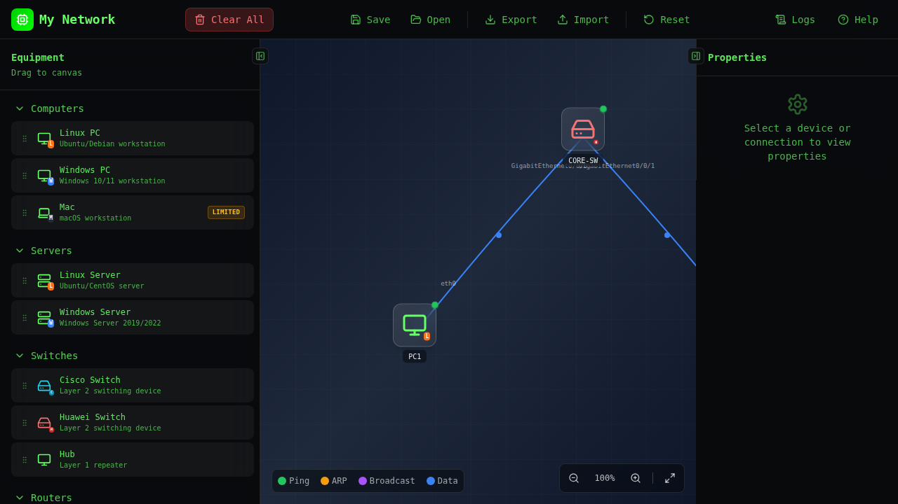
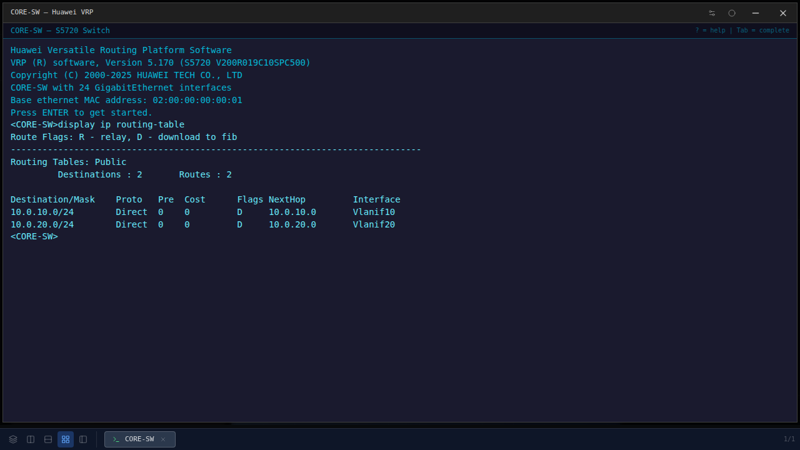
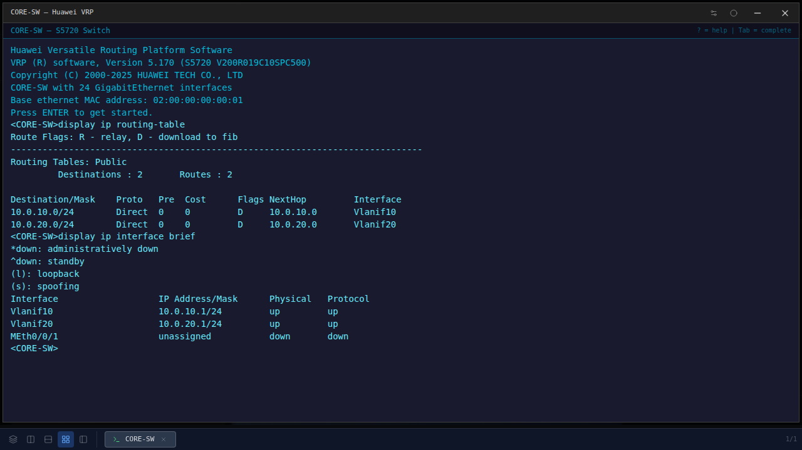
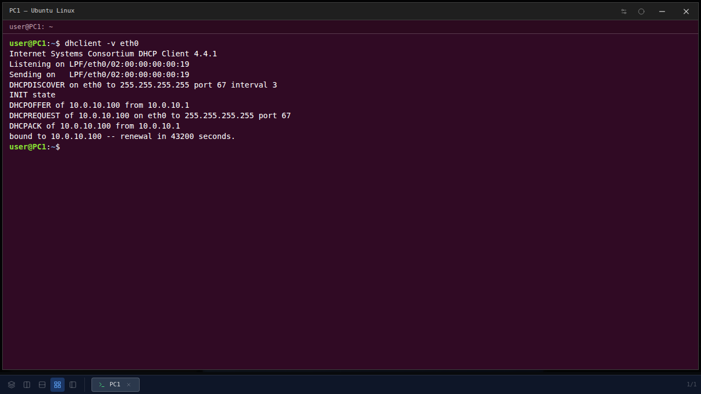
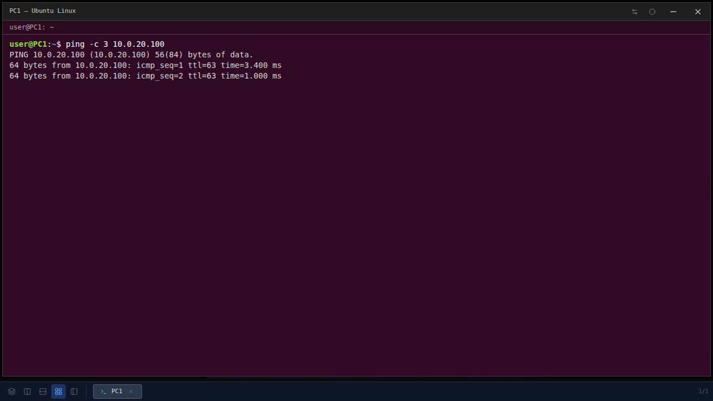
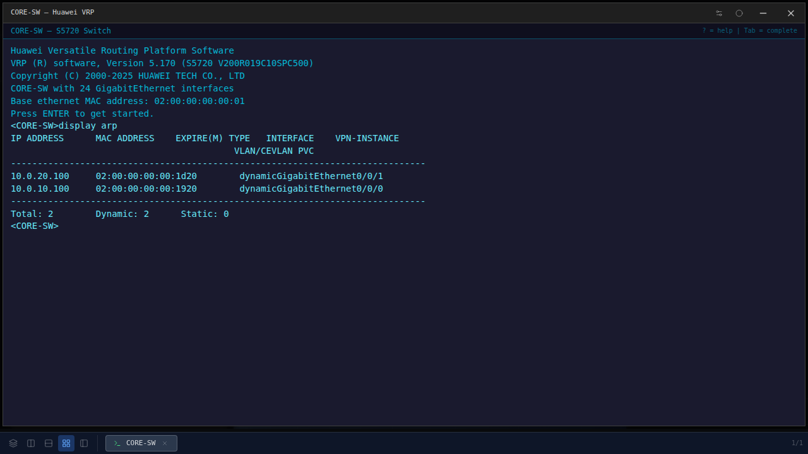

# Switch L3 de Zéro à Héros : un seul équipement pour le commutage, le routage et le DHCP

> **À qui s'adresse ce tutoriel ?**
> Si tu sais déjà ce qu'est un VLAN et que tu as déjà tapé `ip address` sur une interface, tu es au bon endroit. On va prendre un switch Huawei et lui faire faire ce que faisait avant un routeur séparé : router entre VLANs, distribuer des baux DHCP, servir de passerelle. C'est ce qu'on appelle un **switch de niveau 3** (ou *L3 switch*). 🚀

---

## Table des matières

1. [C'est quoi un switch L3 ?](#1-cest-quoi-un-switch-l3-)
2. [Le problème que ça résout](#2-le-problème-que-ça-résout)
3. [Les briques essentielles : VLAN, SVI, table de routage](#3-les-briques-essentielles--vlan-svi-table-de-routage)
4. [Notre laboratoire](#4-notre-laboratoire)
5. [Configurer les VLAN et les ports d'accès](#5-configurer-les-vlan-et-les-ports-daccès)
6. [Créer les SVI (Vlanif) — les passerelles](#6-créer-les-svi-vlanif--les-passerelles)
7. [Vérifier l'état L3 du switch](#7-vérifier-létat-l3-du-switch)
8. [Activer le serveur DHCP intégré](#8-activer-le-serveur-dhcp-intégré)
9. [Inter-VLAN routing en action](#9-inter-vlan-routing-en-action)
10. [Diagnostic avec display arp](#10-diagnostic-avec-display-arp)
11. [Aller plus loin : route par défaut, ACL, relais DHCP](#11-aller-plus-loin--route-par-défaut-acl-relais-dhcp)
12. [Les pièges classiques](#12-les-pièges-classiques)
13. [Conclusion](#13-conclusion)

---

## 1. C'est quoi un switch L3 ?

Un **switch classique** (dit *L2* — Layer 2) ne sait travailler qu'avec des adresses MAC. Il regarde l'entête Ethernet, apprend qui est où, et commute les trames. Il ne connaît pas les adresses IP. Pour faire passer un paquet d'un sous-réseau à un autre, il faut un **routeur**.

Un **switch L3** (Layer 3), lui, fait les deux à la fois. Il commute Ethernet ET il route IP. À l'intérieur, c'est un switch avec un mini-routeur intégré, partageant la même table d'adresses MAC et la même puce ASIC pour la performance. Pour l'admin, ça change tout : un seul équipement, un seul câble vers chaque salle, un seul point de configuration.

En entreprise, on appelle ça un déploiement *collapsed core* : on regroupe la couche commutation et la couche routage en une seule boîte. Plus simple, moins cher, et étonnamment souvent suffisant pour des réseaux jusqu'à plusieurs centaines de postes.

## 2. Le problème que ça résout

Imagine un petit bureau : VLAN 10 pour les postes utilisateurs, VLAN 20 pour les serveurs. Sans switch L3, tu as besoin :

- d'un switch L2 (qui ne fait que commuter),
- d'un routeur (qui route entre VLAN 10 et VLAN 20),
- d'un lien trunk entre les deux pour transporter les VLANs (le fameux *router-on-a-stick*),
- de la maintenance double : deux équipements, deux IOS, deux configurations.

Avec un switch L3, **tout ça disparaît**. Le switch est lui-même la passerelle des deux VLANs. Pas de trunk artificiel, pas de routeur séparé, pas de point de défaillance supplémentaire. C'est exactement le scénario qu'on va construire dans ce tuto. 🎯

## 3. Les briques essentielles : VLAN, SVI, table de routage

Trois concepts à maîtriser avant d'attaquer le terminal :

- **VLAN** (Virtual LAN) — un sous-réseau logique au-dessus de la couche Ethernet. Deux ports dans le même VLAN se voient comme s'ils étaient sur le même câble ; deux ports dans des VLANs différents, eux, ne se voient pas… à moins qu'un routeur les relie.
- **SVI** (*Switched Virtual Interface*) — chez Huawei, ça s'appelle `Vlanif<N>`. C'est l'interface IP que le switch porte **dans** un VLAN donné. Elle a une adresse IP, un masque, et elle joue le rôle de passerelle pour tous les hôtes de ce VLAN. C'est la pièce magique qui transforme un L2 en L3.
- **Table de routage** — l'annuaire des sous-réseaux connus. Quand on configure une SVI avec une IP, le switch ajoute automatiquement le sous-réseau correspondant en route *directly connected*. Le L3 sait alors qu'il peut router vers ce sous-réseau.

Une fois ces trois pièces en place : un paquet qui arrive sur VLAN 10 destiné à un hôte de VLAN 20 est intercepté par la SVI Vlanif10, routé via la table, et ressort par Vlanif20. C'est ça, l'**inter-VLAN routing**.

## 4. Notre laboratoire

On part du strict minimum : **un switch Huawei** L3 (qu'on appellera `CORE-SW`) et **deux PC Linux**. PC1 sera dans le VLAN 10, PC2 dans le VLAN 20. Le switch leur servira de passerelle pour les deux VLANs, et **distribuera lui-même des baux DHCP** sur VLAN 10.



Plan d'adressage :

| Équipement | VLAN | IP | Rôle |
|---|---|---|---|
| `CORE-SW` Vlanif10 | 10 | 10.0.10.1/24 | Passerelle VLAN 10 + serveur DHCP |
| `CORE-SW` Vlanif20 | 20 | 10.0.20.1/24 | Passerelle VLAN 20 |
| Pool DHCP `VLAN10` | 10 | 10.0.10.100 → 10.0.10.254 | Distribué automatiquement |
| PC1 | 10 | DHCP | Client |
| PC2 | 20 | 10.0.20.100/24 | Serveur statique |

Pour reproduire dans le simulateur :

1. Drag-and-drop un **switch Huawei** depuis la palette. Renomme-le `CORE-SW`.
2. Drag-and-drop **deux PC Linux** (`PC1`, `PC2`).
3. Tire un câble `PC1` → `CORE-SW` G0/0/0, puis `PC2` → `CORE-SW` G0/0/1.

## 5. Configurer les VLAN et les ports d'accès

Double-clique sur `CORE-SW` pour ouvrir le terminal, et entre :

```
<Huawei> system-view
[Huawei] sysname CORE-SW
[CORE-SW] vlan batch 10 20
[CORE-SW] interface GigabitEthernet0/0/0
[CORE-SW-GigabitEthernet0/0/0] port link-type access
[CORE-SW-GigabitEthernet0/0/0] port default vlan 10
[CORE-SW-GigabitEthernet0/0/0] quit
[CORE-SW] interface GigabitEthernet0/0/1
[CORE-SW-GigabitEthernet0/0/1] port link-type access
[CORE-SW-GigabitEthernet0/0/1] port default vlan 20
[CORE-SW-GigabitEthernet0/0/1] quit
```

**Ce qu'on vient de faire :**

- `system-view` → on entre en mode configuration (équivalent du `configure terminal` de Cisco).
- `sysname CORE-SW` → on renomme le switch.
- `vlan batch 10 20` → on crée les deux VLANs d'un coup (sans cette ligne, les `port default vlan` qui suivent échoueraient).
- Sur chaque port, `port link-type access` + `port default vlan N` → on assigne le port à un VLAN d'accès. Le PC connecté derrière ce port se retrouve donc dans le bon VLAN.

À ce stade le switch est encore un **L2 pur**. Aucun lien IP, rien qui route. PC1 et PC2 ne peuvent pas se voir.

## 6. Créer les SVI (Vlanif) — les passerelles

C'est ici que la magie opère :

```
[CORE-SW] interface Vlanif10
[CORE-SW-Vlanif10] ip address 10.0.10.1 255.255.255.0
[CORE-SW-Vlanif10] undo shutdown
[CORE-SW-Vlanif10] dhcp select global
[CORE-SW-Vlanif10] quit
[CORE-SW] interface Vlanif20
[CORE-SW-Vlanif20] ip address 10.0.20.1 255.255.255.0
[CORE-SW-Vlanif20] undo shutdown
[CORE-SW-Vlanif20] quit
```

**Décryptage :**

- `interface Vlanif10` → on crée (ou on entre dans) la SVI pour le VLAN 10.
- `ip address 10.0.10.1 255.255.255.0` → on lui donne l'IP qui sera la passerelle de tous les hôtes du VLAN 10.
- `undo shutdown` → on l'active. Une SVI fraîchement créée est administrativement *down* par défaut.
- `dhcp select global` → on dit que cette SVI fait partie du périmètre du pool DHCP global qu'on va définir plus loin. C'est ce qui autorise le serveur intégré à répondre aux clients de ce VLAN.

Même chose pour Vlanif20, mais sans `dhcp select global` puisque PC2 sera configuré en statique.

À ce moment-là, le switch **est devenu L3**. Vérifions.

## 7. Vérifier l'état L3 du switch

D'abord la table de routage :

```
[CORE-SW] display ip routing-table
```



Deux entrées `Direct` :

- `10.0.10.0/24 → Vlanif10` — le sous-réseau du VLAN 10, joignable directement via la SVI.
- `10.0.20.0/24 → Vlanif20` — idem VLAN 20.

C'est exactement ce qu'on veut : le switch sait router entre les deux. La colonne `Proto = Direct` signifie « réseau directement connecté », la métrique la plus prioritaire.

Vue plus synthétique avec :

```
[CORE-SW] display ip interface brief
```



Les deux SVIs apparaissent avec leur IP, leur état admin (`up`) et le protocole (`up`). C'est la commande qu'un opérateur tape en premier quand un VLAN a un souci de routage — elle dit en une ligne si le L3 est en place et fonctionnel.

> 💡 **Astuce** : un Vlanif passe à `down` au niveau protocole tant qu'aucun port du VLAN n'est physiquement actif. Si tu vois `proto = down`, vérifie qu'un câble est branché sur un port d'accès de ce VLAN.

## 8. Activer le serveur DHCP intégré

Le switch est déjà routeur. Maintenant on lui demande aussi de **distribuer des IP** aux machines du VLAN 10. Comme un L3 switch en vrai. Une seule fois pour tout le LAN :

```
[CORE-SW] dhcp enable
[CORE-SW] ip pool VLAN10
[CORE-SW-ip-pool-VLAN10] network 10.0.10.0 mask 255.255.255.0
[CORE-SW-ip-pool-VLAN10] gateway-list 10.0.10.1
[CORE-SW-ip-pool-VLAN10] dns-list 8.8.8.8
[CORE-SW-ip-pool-VLAN10] excluded-ip-address 10.0.10.1 10.0.10.99
[CORE-SW-ip-pool-VLAN10] lease day 1
[CORE-SW-ip-pool-VLAN10] quit
```

**Ce qu'on a fait, ligne par ligne :**

- `dhcp enable` — on active globalement le service DHCP du switch (par défaut désactivé).
- `ip pool VLAN10` — on entre dans la vue d'un nouveau pool DHCP qu'on appelle `VLAN10`. Le nom est libre, mais le nommer comme le VLAN qu'il sert est une convention saine.
- `network 10.0.10.0 mask 255.255.255.0` — le sous-réseau dans lequel piocher.
- `gateway-list 10.0.10.1` — l'option 3 envoyée aux clients : leur passerelle par défaut = notre Vlanif10. Le PC saura ainsi qu'il doit sortir par le switch lui-même.
- `dns-list 8.8.8.8` — l'option 6 : le serveur DNS qu'utiliseront les clients.
- `excluded-ip-address 10.0.10.1 10.0.10.99` — on réserve les 99 premières adresses pour des configurations statiques (l'IP de la SVI en fait partie, ainsi qu'éventuelles imprimantes). Le serveur distribuera donc à partir de `.100`.
- `lease day 1` — durée du bail : 1 jour.

Maintenant, sur PC1 :

```
$ dhclient -v eth0
```



Le bail DORA défile : DISCOVER → OFFER → REQUEST → ACK. PC1 reçoit `10.0.10.100` (la première IP non exclue), sa passerelle est `10.0.10.1` (notre Vlanif10), son DNS est `8.8.8.8`. Un *vrai* déploiement, sans routeur ni serveur DHCP séparé.

## 9. Inter-VLAN routing en action

C'est l'instant de vérité. PC1 (VLAN 10, IP DHCP `10.0.10.100`) va pinger PC2 (VLAN 20, IP statique `10.0.20.100`). En L2 pur, c'est impossible — les deux PCs sont dans des broadcast domains différents. Sur notre switch L3, ça doit fonctionner.

Sur PC1 :

```
$ ping -c 3 10.0.20.100
```



3 paquets envoyés, 3 reçus, 0 % de perte. Voici ce qui s'est passé sous le capot :

1. PC1 voit que `10.0.20.100` n'est pas dans son sous-réseau `10.0.10.0/24`. Il envoie le paquet à sa passerelle (= Vlanif10 = `10.0.10.1`).
2. Le switch reçoit le paquet sur Vlanif10. Il consulte sa table de routage : `10.0.20.0/24` est *Direct* via Vlanif20.
3. Il résout `10.0.20.100` via ARP sur Vlanif20 (broadcast dans le VLAN 20).
4. PC2 répond son MAC, le switch met à jour son cache ARP, transmet le paquet à PC2.
5. PC2 reçoit le ping, répond. Trajet inverse via Vlanif20 → Vlanif10 → PC1.

Tout ce ballet se passe **dans le switch**. Sans lui, on aurait eu besoin d'un routeur dédié et d'un trunk. Avec lui, deux câbles d'accès et zéro équipement supplémentaire.

## 10. Diagnostic avec display arp

Au passage le switch a appris les MAC des deux PCs (puisque ses SVIs ont parlé ARP pour eux). On peut le vérifier :

```
[CORE-SW] display arp
```



Deux entrées dynamiques :

- `10.0.10.100` (PC1) — apprise via Vlanif10.
- `10.0.20.100` (PC2) — apprise via Vlanif20.

Cette table est ton premier réflexe en cas de souci : si un hôte n'apparaît pas, ARP n'a pas abouti — soit le port du VLAN est down, soit l'hôte ne répond pas, soit son IP est mal configurée. C'est le pendant L3 du `display mac-address` qu'on utilise au L2.

## 11. Aller plus loin : route par défaut, ACL, relais DHCP

Trois extensions qu'on rencontre dans la vraie vie :

### Route par défaut vers Internet

Si le switch doit faire sortir le trafic vers l'extérieur (un routeur en amont) :

```
[CORE-SW] ip route-static 0.0.0.0 0.0.0.0 10.0.99.1
```

Cette ligne crée la fameuse *gateway of last resort* : tout paquet pour un sous-réseau inconnu sort par `10.0.99.1`. Combinée à une SVI sur le VLAN « WAN », le switch devient le routeur principal du site.

### ACL inter-VLAN

Tu veux que les utilisateurs (VLAN 10) puissent atteindre les serveurs (VLAN 20) seulement sur les ports 80 et 443 ? Une ACL avancée sur Vlanif10 inbound :

```
[CORE-SW] acl 3000
[CORE-SW-acl-adv-3000] rule permit tcp source 10.0.10.0 0.0.0.255 destination 10.0.20.0 0.0.0.255 destination-port eq www
[CORE-SW-acl-adv-3000] rule permit tcp source 10.0.10.0 0.0.0.255 destination 10.0.20.0 0.0.0.255 destination-port eq 443
[CORE-SW-acl-adv-3000] rule deny ip source 10.0.10.0 0.0.0.255 destination 10.0.20.0 0.0.0.255
```

C'est exactement la même grammaire que sur un routeur Huawei — l'avantage d'avoir une CLI VRP partout.

### Serveur DHCP centralisé (relais)

Tu préfères que les baux viennent d'un serveur central, pas du switch lui-même ? On désactive `dhcp select global` sur la SVI et on la passe en mode **relais** :

```
[CORE-SW] interface Vlanif10
[CORE-SW-Vlanif10] undo dhcp select global
[CORE-SW-Vlanif10] dhcp select relay
[CORE-SW-Vlanif10] dhcp relay server-ip 192.168.99.10
```

Le switch arrête de servir lui-même et **relaie** les DHCP DISCOVER vers `192.168.99.10`. Les broadcasts du VLAN 10 sont transformés en unicast vers le serveur, qui répond directement. Le `display interface Vlanif10` du switch montre alors une ligne `DHCP relay server-ip 192.168.99.10` sous l'adresse Internet.

## 12. Les pièges classiques

### Mon Vlanif est down/down

Trois causes possibles, dans l'ordre :

1. Tu as oublié `undo shutdown`. Une SVI nouvellement créée est administrativement DOWN.
2. Aucun port physique de ce VLAN n'a de lien actif. Le protocole d'une SVI passe UP **seulement** quand au moins un port du VLAN est up + un câble est branché.
3. Tu n'as pas créé le VLAN avec `vlan batch N` (Huawei refuse silencieusement de monter une Vlanif pour un VLAN qui n'existe pas dans la base de VLANs).

### Mes PCs ne se voient pas malgré le routage

Vérifie la **passerelle par défaut** de chaque PC. Si PC1 a comme gateway l'IP d'un autre routeur (ou rien), il n'enverra pas son paquet inter-VLAN au switch. En DHCP, le `gateway-list` du pool fait le travail — en statique, c'est `ip route add default via 10.0.10.1` sur Linux.

### display ip routing-table ne montre pas la route

Soit l'IP n'est pas configurée (`display this` dans la Vlanif pour vérifier), soit la SVI est down (cf. ci-dessus), soit le sous-réseau de la SVI est en conflit avec une autre route (un `ip route-static` du même préfixe par exemple).

### Pool DHCP épuisé

`display ip pool name VLAN10` te dit combien d'IPs sont distribuées. Si tout est pris : raccourcis la durée des baux (`lease day 0 hour 2` pour 2 h), ou agrandis le pool (passe en `/23`), ou purge les baux fantômes.

## 13. Conclusion

On vient de transformer un switch Huawei en équipement L3 complet, en moins de 20 lignes de configuration. Récapitulons :

- **VLAN + ports d'accès** → on segmente le trafic au L2 (`vlan batch`, `port link-type access`, `port default vlan`).
- **SVI (Vlanif)** → chaque VLAN reçoit sa passerelle IP (`interface Vlanif`, `ip address`, `undo shutdown`). C'est ce qui transforme un L2 en L3.
- **`display ip routing-table` + `display ip interface brief`** → on vérifie que les sous-réseaux sont bien *Direct* et les SVIs UP.
- **Serveur DHCP intégré** → `dhcp enable` + `ip pool` + `dhcp select global` sur la SVI = pas besoin d'un serveur séparé.
- **Inter-VLAN routing** → ça fonctionne tout seul dès que les SVIs sont en place.
- **`display arp`** → le couteau suisse du diagnostic L3.

Le même équipement assure désormais commutation, routage et DHCP. C'est le déploiement *collapsed core*, et c'est aussi simple à comprendre que la somme de ses parties.

Côté Cisco, exactement les mêmes concepts s'appliquent — la grammaire change un peu (`interface Vlan 10` au lieu de `Vlanif10`, `ip dhcp pool` au lieu de `ip pool`, `show ip route` au lieu de `display ip routing-table`), mais l'architecture est identique. Si tu as compris Huawei, tu sauras lire un IOS sans transition.

> **Pour aller plus loin :**
> - Configure un **relais DHCP** vers un serveur central et observe avec `display interface Vlanif10` que le helper apparaît.
> - Ajoute une **ACL avancée** sur Vlanif10 pour autoriser uniquement HTTP/HTTPS vers les serveurs.
> - Cable un deuxième switch en uplink et configure un **trunk 802.1Q** entre les deux pour transporter les VLANs sur le lien.

Bon switching ! 🎉
